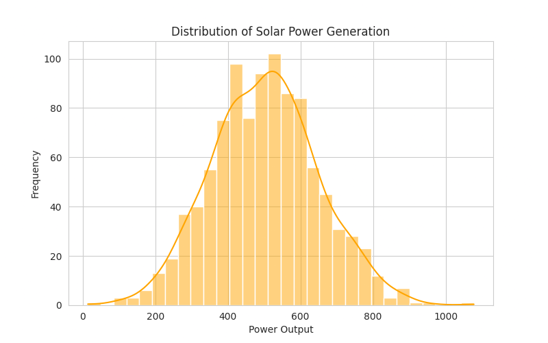
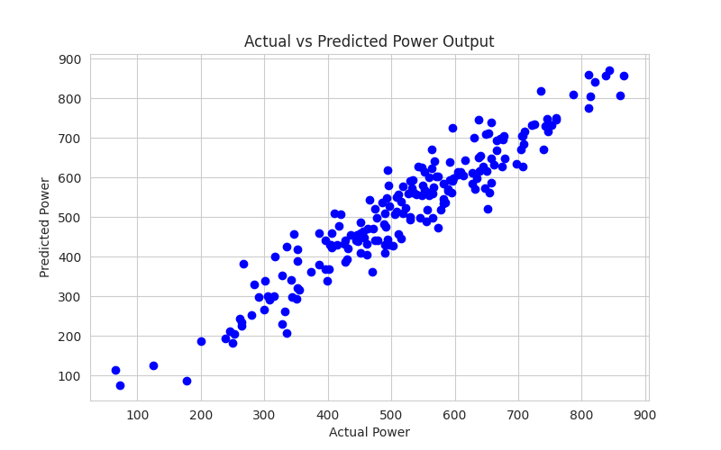

# ☀️ Solar Power Generation Prediction

## 🎯 Business Objective
Predict solar power generation using environmental and system-related features to improve energy efficiency and planning.

---

## 📊 Project Overview
This project focuses on building a regression model to estimate solar power output based on input features such as weather conditions and system parameters.

---

## 🔍 Key Features
- Data preprocessing and cleaning  
- Handling missing values  
- Feature selection  
- Regression model building  
- Model evaluation  

---

## 🧠 Model Used
- Linear Regression  
- (You can add: Random Forest / Decision Tree if used)

---

## 📈 Workflow
1. Data Collection  
2. Data Cleaning  
3. Exploratory Data Analysis (EDA)  
4. Feature Engineering  
5. Model Training  
6. Evaluation  

---

## 💻 Tech Stack
- Python  
- Pandas  
- NumPy  
- Scikit-learn  
- Matplotlib / Seaborn  

---

## 📂 Dataset
Solar power generation dataset containing:
- Environmental factors (temperature, irradiation, etc.)  
- System parameters  
- Power output  

---

## 📊 Results
- Built a regression model to predict solar power output  
- Evaluated using metrics like MAE, MSE, R²  

---

## 📸 Screenshots

### 📊 Data Analysis

### 📈 Prediction Graph

---

## 🚀 Future Improvements
- Improve model accuracy using advanced algorithms  
- Deploy as a web app (Streamlit)  
- Real-time prediction integration  

---

## 🔗 GitHub Repository
https://github.com/Venkatamalini/solar-panel---regression

## 🚀 Live Streamlit App

🔗 Click here to open the app:

[Solar Panel Power Prediction App](https://YOUR_STREAMLIT_URL.streamlit.app)
